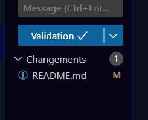
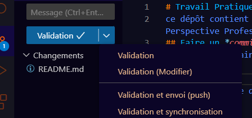

# Travail Pratique 2
ce dépôt contient le code d’un projet web fait dans le cours de Perspective Professionnelles. 
## Faire un *commit et un push dans Visual Studio Code* 
Voici comment faire un changement sur ce projet, et l’envoyer sur GitHub
1)     Ouvrir le panel de contrôle source (Source Control Panel)
2)     Cliquée sur l'icône + et appuyés sur l'icône "Stage All Changes"
3)     Entrer un message pour commit dans la zone prévue à cette effet dans le panel de control source (Source Control Panel)
4)     Cliquée sur le bouton "..." au top du panel de contrôle source (Source Control Panel) et selectionnée envoyée (push)

## Contributeurs
* [William Blouin](https://github.com/Goldorak715) - Auteur Principal

## License
Copyright @ 2024 William Blouin. Tous droits réservés. 
